<div align="center">

# 🍕 Amateur Site Pizzeria 🍕

## Сменить язык: [Русский](README.ru.md)

[](https://www.djangoproject.com/)
[](https://python.org)
[](https://opensource.org/licenses/MIT)

</div>

---

## ⚠️ Legal Notice
**This project is developed solely for educational purposes** for learning the Django framework and web development.

The site is a fan project inspired by the Five Nights at Freddy's universe, with the following limitations:
- 🚫 No use of copyrighted materials
- 🚫 No application of original content from the game series
- 🚫 Not a commercial or official product
- 🚫 Compliance with fair use principles

The project includes only source code, media files are not distributed.

---

## 🌟 Key Features

<div align="center">

<table>
    <tr>
        <td valign="top" width="50%">
            <h3 align="center">👨‍🍳 Pizzeria Functionality</h3>
            <p align="center">
                
                
                
            </p>
            <div style="text-align: left; margin-left: 20px;">
                <ul style="text-align: left; padding-left: 20px;">
                    <li>🍕 Full-featured menu with category system</li>
                    <li>📋 Detailed product information with characteristics</li>
                    <li>🖼️ Dynamic image loading through the administrative interface</li>
                    <li>🔍 Intuitive navigation and category search system</li>
                </ul>
            </div>
        </td>
        <td valign="top" width="50%">
            <h3 align="center">👤 User System</h3>
            <p align="center">
                
                
                
            </p>
            <div style="text-align: left; margin-left: 20px;">
                <ul style="text-align: left; padding-left: 20px;">
                    <li>🔐 Full registration and authentication system</li>
                    <li>👨‍💻 Personalized user profiles</li>
                    <li>🛡️ Protection against brute-force attacks using django-axes</li>
                    <li>🔒 Automatic locking upon detection of suspicious activity</li>
                </ul>
            </div>
        </td>
    </tr>
</table>

</div>

> **📱 Responsive Design**: The website displays flawlessly on all devices — from desktops to smartphones. Interactive elements are enhanced with smooth hover and focus animations.

---

## 🛠 Technology Stack

<div align="center">

<table>
    <tr>
        <th>Component</th>
        <th>Version</th>
        <th>Purpose</th>
        <th>Badge</th>
    </tr>
    <tr align="center">
        <td>Python</td>
        <td>3.11+</td>
        <td>Main programming language</td>
        <td></td>
    </tr>
    <tr align="center">
        <td>JavaScript</td>
        <td>ES6+</td>
        <td>Interactivity and scripts</td>
        <td></td>
    </tr>
    <tr align="center">
        <td>CSS</td>
        <td>3</td>
        <td>Styling and design</td>
        <td></td>
    </tr>
    <tr align="center">
        <td>HTML</td>
        <td>5</td>
        <td>Page markup and structure</td>
        <td></td>
    </tr>
    <tr align="center">
        <td>Django</td>
        <td>5.2</td>
        <td>Backend framework</td>
        <td></td>
    </tr>
    <tr align="center">
        <td>SQLite3</td>
        <td>-</td>
        <td>Default database</td>
        <td></td>
    </tr>
    <tr align="center">
        <td>Pillow</td>
        <td>11.2.1</td>
        <td>Image processing</td>
        <td></td>
    </tr>
    <tr align="center">
        <td>django-axes</td>
        <td>8.0.0</td>
        <td>Protection against brute-force attacks</td>
        <td></td>
    </tr>
    <tr align="center">
        <td>django-cleanup</td>
        <td>9.0.0</td>
        <td>Media file management</td>
        <td></td>
    </tr>
    <tr align="center">
        <td>django-csp</td>
        <td>4.0</td>
        <td>Security policy</td>
        <td></td>
    </tr>
    <tr align="center">
        <td>python-dotenv</td>
        <td>1.1.0</td>
        <td>Configuration management</td>
        <td></td>
    </tr>
</table>

</div>

---

## 📦 Installation and Deployment

### 📋 System Requirements
- Python 3.10 or newer
- Recommended use of a virtual environment

### 🔧 Configuration
1. Clone the project repository
2. Create and activate a virtual environment:
```bash
python -m venv .venv
source .venv/bin/activate  # Linux/macOS
# or
.venv\Scripts\activate  # Windows
pip install -r requirements.txt
```
4. Set up environment variables in the .env file:
```python
SECRET_KEY = 'your-secret-key-here' # Replace with your secret key
DEBUG = True
```
5. Apply migrations (database is created automatically):
```bash
python manage.py migrate
```
6. Create a superuser:
```bash
python manage.py createsuperuser
```
7. Start the server (locally on your PC):
```bash
python manage.py runserver
```

---

## 🌿 BRANCHING STRATEGY
The project uses version control with two main branches:

### 🛠️ Development Branch
**Purpose**: Active development of new features

**Features**:
- Full source files with comments
- Uncompressed CSS and JavaScript files
- Experimental capabilities
- Detailed code documentation

### 🚀 Main Branch
**Purpose**: Stable production builds

**Features**:
- Optimized and compressed CSS and JavaScript files
- Code cleaned of comments
- Versions ready for deployment

---

## 📁 Project Structure (main)
```
amateur-site-pizzeria/
├── .venv/                       # Python virtual environment (not added to git)
├── config/                      # Main project configuration package
│   ├── __init__.py              # Marks directory as Python package
│   ├── asgi.py                  # ASGI configuration for async servers
│   ├── settings.py              # Main project settings (DB, apps, middleware)
│   ├── urls.py                  # Main URL routing file for the entire project
│   ├── views.py                 # Global project view functions
│   └── wsgi.py                  # WSGI configuration for server deployment
├── media/                       # Directory for admin-uploaded dish images
│   └── menu_images/
├── menu/                        # App for managing pizzeria menu
│   ├── migrations/              # Database migrations for menu models
│   ├── __init__.py              # Marks directory as Python package
│   ├── admin.py                 # Model registration in Django admin panel
│   ├── apps.py                  # Configuration of the menu app
│   ├── models.py                # Data models
│   ├── urls.py                  # URL routing for the menu app
│   └── views.py                 # View functions for working with the menu
├── readme_images/               # Pictures for README file
├── static/                      # Static files (CSS, JS, images, fonts)
│   ├── css/                     # CSS styles for various pages
│   │   ├── 404.css              # Styles for 404 error page
│   │   ├── base.css             # Base styles (common to all pages)
│   │   ├── home.css             # Styles for main page
│   │   ├── locked.css           # Styles for account lock page
│   │   ├── menu.css             # Styles for menu pages
│   │   ├── profile.css          # Styles for profile page
│   │   └── registration.css     # Styles for registration and authorization pages
│   ├── font_awesome/            # Font Awesome icon library
│   ├── js/                      # JavaScript files
│   │   ├── 404.js               # JS for 404 error page
│   │   ├── home.js              # JS for main page
│   │   ├── locked.js            # JS for lock page
│   │   └── password_toggle.js   # Password visibility toggle
│   ├── media/                   # Static media files
│   │   ├── error_404/           # Media files for 404 page
│   │   │   ├── ring.mp3
│   │   │   ├── static.mp3
│   │   │   └── whisper.mp3
│   │   ├── favicon/             # Site favicons
│   │   ├── home/                # Media files for main page
│   │   │   ├── home1.png
│   │   │   ├── home2.png
│   │   │   ├── home3.png
│   │   │   ├── home4.png
│   │   │   ├── click.mp3
│   │   │   ├── secret.mp3
│   │   │   ├── scream.mp3
│   │   │   └── screamer.mp4
│   │   └── menu/                # Media files for menu
│   │       └── image_missing.png
├── templates/                   # HTML templates
│   ├── menu/
│   │   ├── categories.html      # Menu categories template
│   │   ├── item_detail.html     # Specific dish template
│   │   └── items.html           # Template for dishes of a specific category
│   ├── registration/
│   │   ├── logged_out.html      # Account logout template
│   │   ├── login.html           # Account login template
│   │   └── register.html        # Registration template
│   ├── users/
│   │   ├── locked.html          # User lock template
│   │   └── profile.html         # User personal profile template
│   ├── 404.html                 # 404 error template
│   ├── base.html                # Base template
│   └── home.html                # Main page template
├── users/                       # App for user management
│   ├── __init__.py              # Marks directory as Python package
│   ├── apps.py                  # Configuration of the users app
│   ├── forms.py                 # Registration and authorization forms
│   ├── urls.py                  # URL routing for the users app
│   └── views.py                 # View functions for working with users
├── .env                         # Environment variables file (secrets, settings)
├── .gitignore                   # Files and directories ignored by git
├── db.sqlite3                   # SQLite database (not added to git)
├── LICENSE                      # Project license
├── README.md                    # Project documentation in English
├── README.ru.md                 # Project documentation in Russian
├── requirements.txt             # Python project dependencies
└── manage.py                    # Main script for managing Django project
```
---

## 📸 Preview
> ⚠️ **Note**: The website is temporarily not hosted. For reference, I've attached screenshots of the main pages. Images are blurred due to copyright restrictions.

### 🏠 Home Page
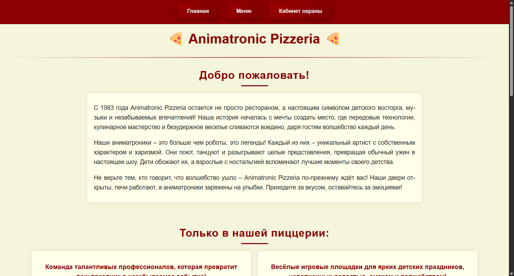
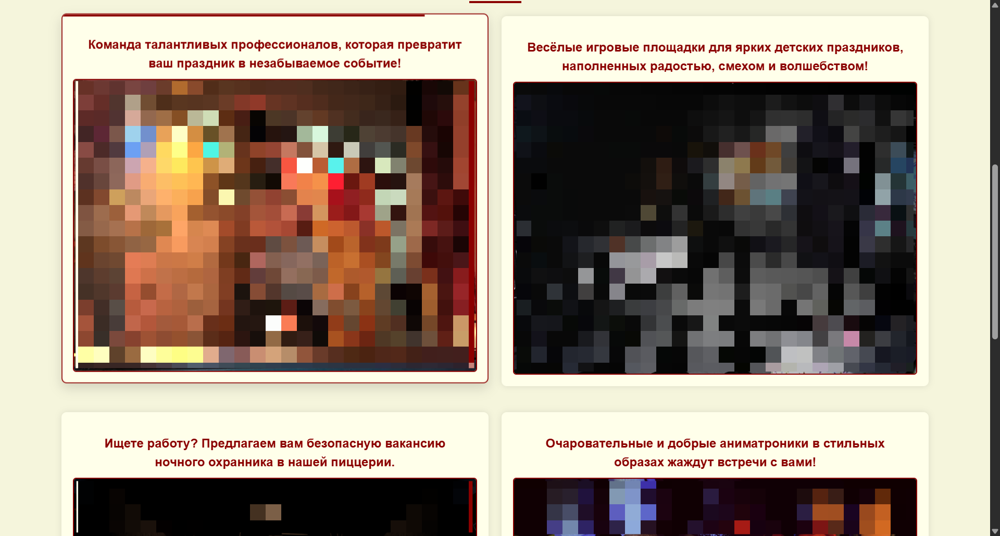
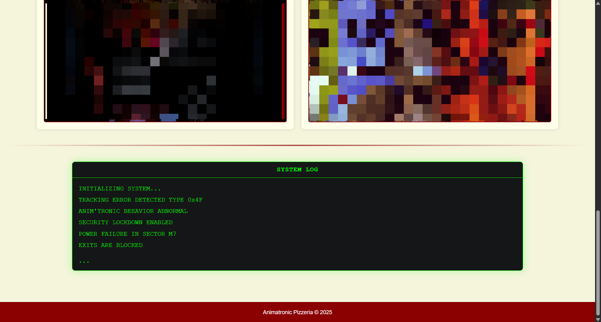
> **Note**: The home page features an interactive terminal.

### 🍔 Menu
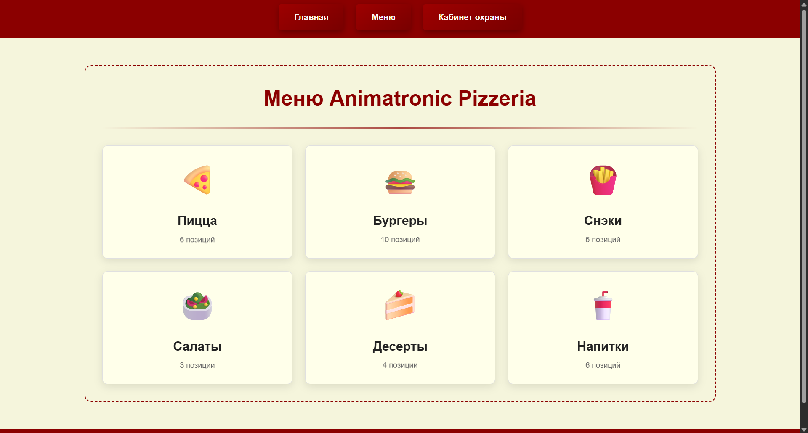
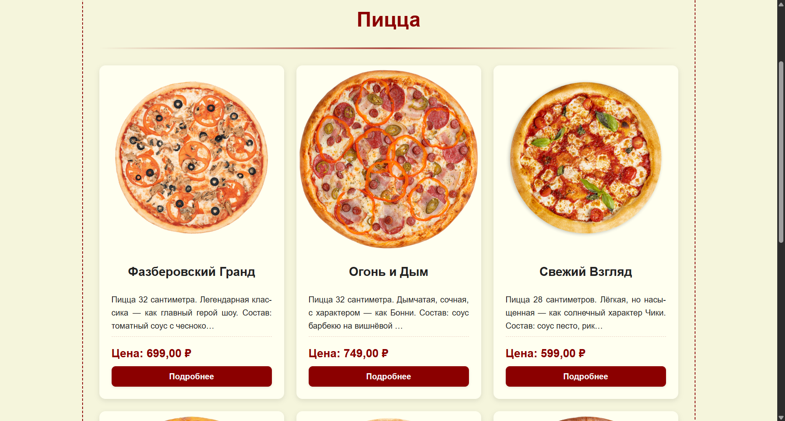
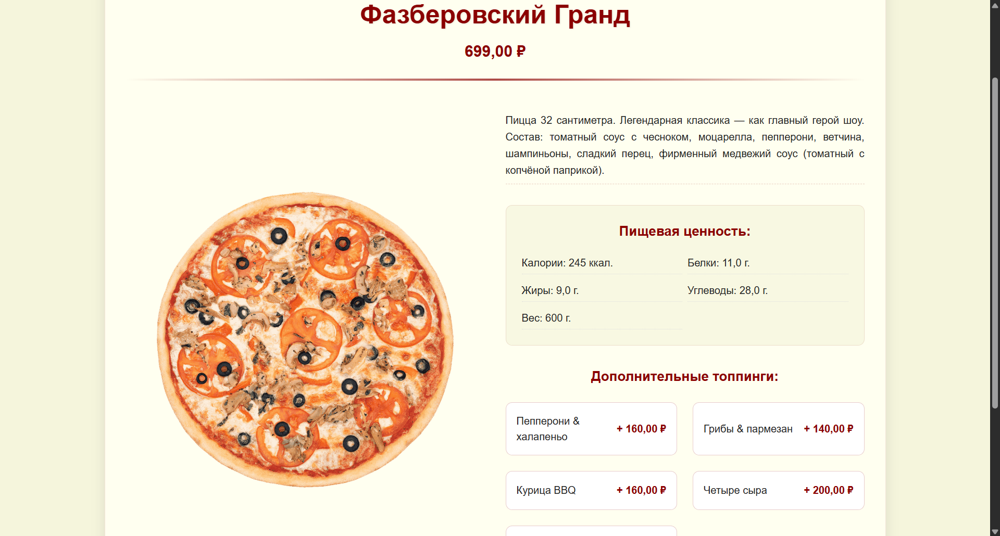
> **Note**: The menu is loaded from the website database.

### 🔐 Login and Registration
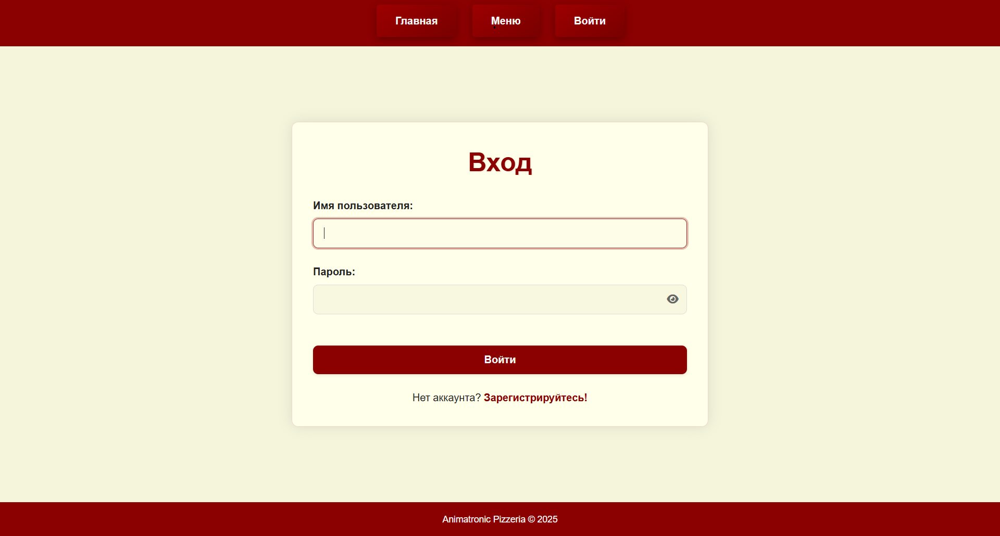
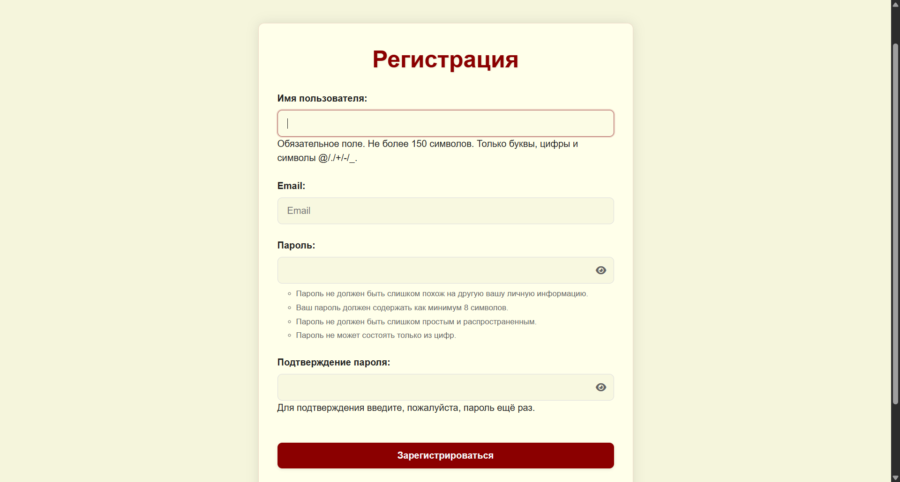
> **Note**: Includes a script to show/hide password visibility.

### 👤 Personal Account
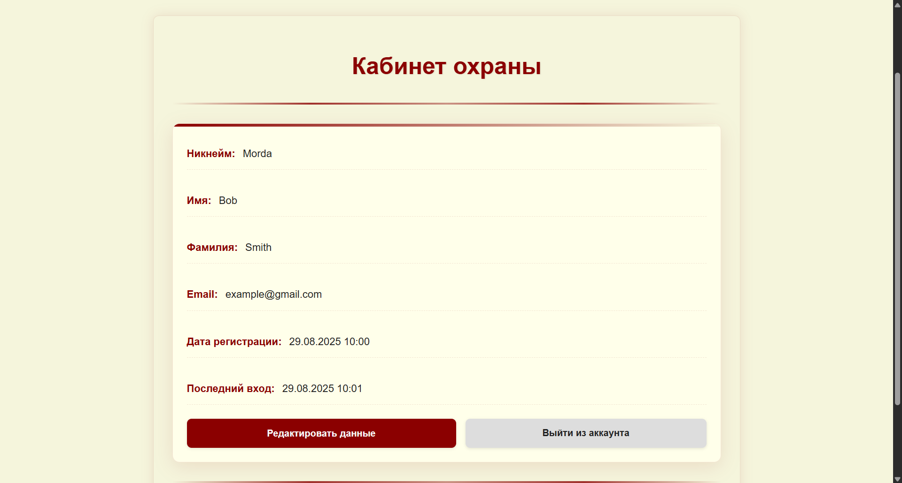

> **Note**: Users can edit some of their personal data.

### ⚙️ Admin Panel
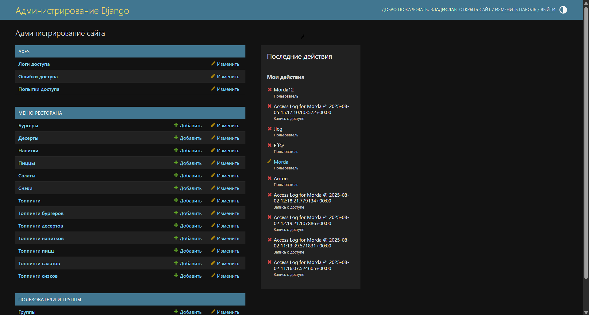
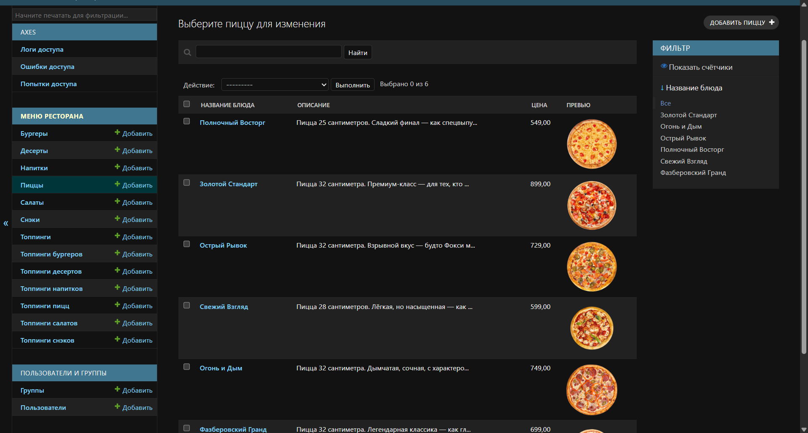
> **Note**: Allows editing menu items and adding new ones with image upload functionality.

---

## 🎯 Educational Goals
The project is implemented to master key aspects of web development:
- ✅ MVC/MVT Architecture - Understanding Django application structure
- ✅ ORM and Migrations - Working with data models and migrations
- ✅ Authentication - Implementing user security systems
- ✅ Static and Media - Managing static and dynamic resources
- ✅ Administrative Interface - Creating management panels
- ✅ Web Application Security - Protection against common vulnerabilities
- ✅ Performance Optimization - Methods for improving speed

## ⚠️ Important Note
This project was developed by a beginner self-taught programmer. The code may contain:
- ❌ Errors and bugs
- ⚡ Suboptimal solutions
- 🛡️ Architectural shortcomings

---

## 📩 Contacts
I'm open to constructive criticism and suggestions for code improvement. If you found an error or know how to do something better - please contact me!

[](https://t.me/MordaRedFox)
&nbsp;
[](mailto:mordaredfox@gmail.com)
